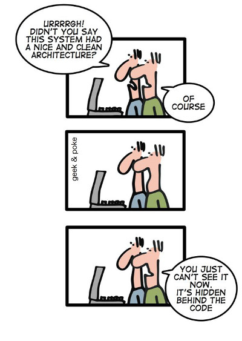

Concept
=======
 

This page looks at the reasoning and motivation behind the creation of exceed. If you're eager to more concrete and
hands-on information, you can skip this for now.

> model-based full-stack web application engine.

What does that mean? Let's look at it piece by piece. 

> web application engine

Well first of all, it's about modern internet applications, of many kinds and complexities. We call it an engine because
it executes and orchestrates your business logic as a complex system of inter-locking parts. You could call it a framework, too,
and it is certainly extensible and adaptable on many levels.

> full-stack

Exceed generates front-end and back-end functionality from one source of truth, can configure databases to support that truth. 

> model-based

Everything is based on a inter-connected data model. It describes all parts and connects them to one another. It defines what things are and
how they are processed. It defines a routing map for the user through out the application.  

Motivation
----------

Let's go deeper into the motivation and results of using a data model driven application engine/framework. Partial data 
models or their visual representations are a quite common part of software development. There are a lot of methodologies
for software development, but most of them and especially the viable ones, involve some level of planning and modeling.
Even if this only happens on a whiteboard in an office or scribbled on a piece of paper.

There have been attempts at using data-sets for actual software development. Prolog is an early example for a data driven 
or logical programming language. There are formal methods to describe program structures like UML and its diagram forms. 
For the most parts these tools mostly apply to the early design and development phase of a software project and 
deteriorate with age. A project starts with lots of good intentions and diagrams which are left aside once the basic shape
of the application is established. Often the diagrams are not even regarded as software development artifacts and just 
happen to lie around on Bob's old computer. Even if they're kept and archived, very few projects go through the trouble
of keeping diagrams updated. There are also technical challenges in the iterative improvement of software models. 
Most common are generators that turn a data description into code and then you're stuck with that code and there's no
way to make changes to that code and have the model reflect those changes.  

Code deterioration can go further and further. The implementation quality can suddenly start to vary within subsystem and 
people implementing them. Even with an application style guide, people tend to reinvent things all the time leading to 
more and more inconsistencies. If sub systems in a larger application grow one after another, they are often identifiable 
as belonging to a certain year or era by the way they are built.

Once you hit the nitty gritty code level, you're not going back. All the nice order and organization you have gets choked
on all the "code" added to it.

Introducing Models
------------------

Our model-based approach is similar to [Model-driven architecture](https://en.wikipedia.org/wiki/Model-driven_architecture).
There is no platform-specific model though, or rather it is generated at system startup.

The model is the primary artifact of application development in exceed and remains central through the whole service 
lifetime of the application. The model evolves with the business requirements with more models and model changes. In a
80:20 kind of rule we expect roughly 80% of the application code to be realized just by model composition, leaving 20%
of application specific extensions and integration code. 

The exceed base distribution provides common domain types and administrative functions common to many web applications.
Over time, a library of reusable macro-components will grow.

Model-based application development provides a clear mandatory application structure that itself data-drive and can be 
further manipulated or be created by transforming data from other sources. 

The implementation quality of a model-based application is 100% uniform.

New functionality, improvements or bug fixes can be implemented once in the base system and can be rolled out uniformly
by updating the base system.  

OpenSAGA, the predecessor
-------------------------

Exceed is in fact the second such model-based system we developed. The first was [OpenSAGA](http://www.opensaga.org/) which
we successfully used in a number of projects for small and medium enterprises to larger government agency websites.

Exceed is an attempt to learn from the parts of OpenSAGA that did not work out so well and improve on them. Many of the 
design decisions in exceed follow the parts of OpenSAGA that did seem to work well. 

---
[Cartoon from http://geek-and-poke.com/: Clean Architecture](http://geek-and-poke.com/)
